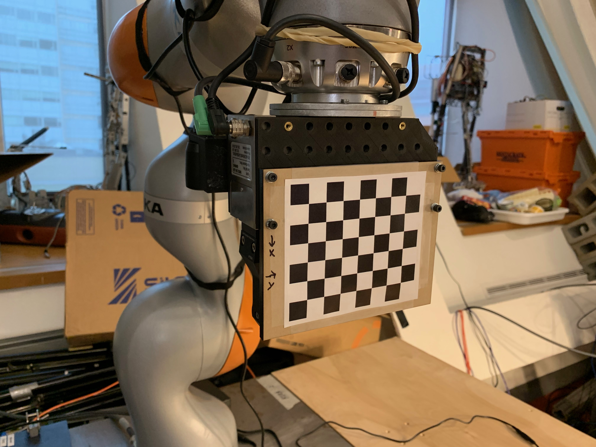

# Camera calibration in Spartan


The goal of all the following steps is to produce the following files. Suppose your camera is named `<camera_name>` then the following proceduce will result in 3 files being created in the folder 
`spartan/src/catkin_projects/camera_config/data/<camera_name>/master`

- `rgb_camera_info.yaml` contains intrinsics for RGB camera
- `depth_camera_info.yaml` contains intrinsics for depth camera.
- `camera_info.yaml` contains extrinsics for both rgb and ir cameras.


See `carmine_1` as an example of a camera that has already been calibrated.

---
## Setup
### Calibration Target
There should already be a calibration target setup which looks like
<p align="center">
  
</p>

The pdf of this target is in `spartan/src/catkin_projects/camera_config/data/calibration_targets/check_7x6_108mm.pdf`. When sized to print on letter size paper the edge length of an individual square was measured to be 25.6 mm.

### Prepare to capture images

- Decide the device's serial number or name
- Create a new folder in `src/catkin_projects/station_config/<robot_name>/hand_eye_calibration` and create a new `.yaml` file.  Copy over the structure from another yaml file. `<robot_name>` should be something like `RLG_iiwa_1` or `RLG_iiwa_2`.
- Specify in `iiwamanipdev.py` what the name of this `.yaml` file is within `station_config`
- Create a new folder in `src/catkin_projects/camera_config/data` and copy over the structure from other folders
- Rebuild catkin_project/fast
```
cd spartan/build
make catkin_projects/fast
```
- When you launch the sensor via `roslaunch camera_config openni2.launch`, pass the serial_number/camera_name you chose.
- **Note**: You cannot stream RGB and IR at the same time due to usb 2.

## Intrinsics Calibration

### Intrinsics calibration with ROS Camera Calibration
First we do intrinsics.
- Open director, put the robot into the `Calibration - intrinsics calibtration pose`
- Open rviz, view the rgb topic, make sure you can walk around with the calibration plate in it

In order to calibration intrinsics for rgb camera, execute the following command, replacing `<camera_name>` with the name of your camera.
```
rosrun camera_calibration cameracalibrator.py --size 7x6 --square 0.0256 image:=/<camera_name>/rgb/image_raw camera:=/<camera_name>/rgb
```

To run the calibration for the ir camera execute
```
rosrun camera_calibration cameracalibrator.py --size 7x6 --square 0.0256 image:=/<camera_name>/ir/image camera:=/<camera_name>/ir
```
- A window will pop out, you should move the calibration plate around until the `CALIBRATE` button gets colored.
- Click the `CALIBRATE` button, the calibration process might take a few seconds, during which the window might gray out, but it is working
- After the calibration is done. Click the `SAVE` button, the calibrated results will be saved to `/tmp/calibrationdata.tar.gz`. Run the following command to move the camera info file to the right place
```
python intrinsics_calibration.py --rgb --camera_name <camera_name>
```

This will create the file `spartan/src/catkin_projects/camera_config/data/<camera_name>/master/rgb_camera_info.yaml` which
holds the RGB intrinsics.

And for IR do:
```
python intrinsics_calibration.py --ir --camera_name <camera_name>
```

This will create the file `spartan/src/catkin_projects/camera_config/data/<camera_name>/master/depth_camera_info.yaml` which 
stores the depth camera intrinsics.

Make sure to rebuild!

```
cd spartan/build
make catkin-projects/fast
```

You'll be sad if you don't rebuild.


---
## Extrinsics Calibration

### Capture images

- Place the calibration target (place the pieces of tape with `*`s on them next to each other)

#### Capture RGB images

- Launch director
- `cal.run()` in the Python terminal (it's f8)
- (by default, the rgb images are captured)
- Open rviz, and look at the camera topic to make sure the target is in frame (at least in most images)
- Images will be saved to, for example:
```
spartan/calibration_data/20180201-233350_rgb/
```

#### Capture IR images

- WARNING: for unknown reasons saving mono16 ir images to .png does not work.  Make sure to use `.bmp` instead.  You can specify this in the `station_config/*/*.yaml` file
- Cover the projector (make sure to not tape the lens!!! A business card folded over, and taped so that no tape touches lenses)
- Set up the IR illuminators (see pic below)

<p align="center">
  
</p>

- View the IR images in rviz and make sure the IR illumination is good enough (it can be sensitive to the height and angle of the IR illuminator)
- `cal.run(captureRGB=False, captureIR=True)`
- Open rviz, and look at the camera topic to make sure the target is in frame (at least in most images)
- Images will be saved to, for example:
```
spartan/calibration_data/20180201-2335959_ir/
```

Remember to remove the projector-covering device!!

### Optimize Extrinsics using Handical

Handical's main dependency gtsam, should be be correctly built during the docker build.

First add gtsam to your PYTHONPATH. To do this do the following, you can see these defined in `entrypoint.sh`.

```
use_spartan
use_handical
```

Now we need to actually build and install install handical.

```
cd ~/spartan/src/handical
mkdir build
cd build
cmake ..
make -j8
sudo make install -j8
```

Then navigate to handical's python interface:

```
cd ~/spartan/src/handical/python
```

In your favorite text editor, change the args at the top of the `run_handical_rlg.py` file to wherever you stored your data:

```
rgb_calibration_data_folder = os.path.join(spartan_source_dir, 'calibration_data', '20190329-001052_rgb')
depth_calibration_data_folder = os.path.join(spartan_source_dir, 'calibration_data', '20180223-205019_ir')
camera_info_filename_destination = "src/catkin_projects/camera_config/data/carmine_1/master/camera_info.yaml"
```

Then run!

```
python run_handical_rlg.py
```

And then make catkin-projects:

```
cd ~/spartan/build
make catkin-projects/fast -j8
```

## Testing

### Test the calibration quality

DO THESE TESTS:

1. Verify in rviz that the frames (rgb and depth) generally look in the right spot

2. Point the depth sensor down at the table and verify it looks generally flat

3. Can even point robot at itself and see if the point cloud matches the urdf

4. In RVIZ open `image_rect_color` and verify that it doesn't look distorted. A good way to do that is to look at the checkerboard and edges of the table.


TODO
- later: clean up station_config structure (not just one cal.yaml)
- extrinsics should live in station_config
- adjust joint limits


# External fixed-mount camera calibration

Before beginning, make sure you've done all the code related setup above (build handical, etc.)

This calibration routine will assume that the intrinsics and the "internal extrinsics" (i.e., color-to-ir, etc.) calibration of the sensors is already good.

Our goal is just to get a good extrinsics calibration between one of the camera sensors, and the robot. 

## Step 1: Mount the calibration target

We have made a plate with a calibration target that screws on.

The coordinate frame for the target is labeled in the image.

<p align="center">
  
</p>

## Step 2: Launch the sensor

For example for the D415, see the D415 readme in KukaHardware repo.

Make sure to **launch the sensor as high resolution as possible**.
For example the D415 does 1920x1080 resolution, but you need to launch
it with these params.

## Step 3: Teleop around to save good poses for calibration

1. Open up rviz and open a window for the high-res camera, make it a large window.
2. `python simple_teleop.py` (which lives in `src/catkin_projects/simple_teleop`)
3. press `o` to save any pose.
4. press `escape` when done.

## Step 4: Re-run through the poses while saving all data

- First arg is topic name
- Second arg is the filename of the poses, in the format saved out from Step 3.  The example below
point to pre-saved poses Pete collected.

```
cal.runFixedMount("/camera/color/image_raw", "/home/peteflo/spartan/modules/spartan/calibration/camera_right_calibration_poses.yaml")
```

The above will save out a folder called something like `~/spartan/calibration_data/20190330-185613_rgb`.

You just need to a couple more things:

1. Make an `rgb_camera_info.yaml` for the camera with its intrinsics (haven't yet written a script for this) and put it also in the folder above
2. Edit the `robot_data.yaml` to make sure the following header is what you want (for example you may want to change the camera name)

```
header:
  camera: d415_02
  image_type: rgb
  target:
    height: 6
    square_edge_length: 0.01322
    transform_to_hand_frame:
      quaternion:
        w: -0.48883249
        x: 0.49894425
        y: 0.50080633
        z: 0.51116578
      translation:
        x: 0.0
        y: 0.0
        z: 0.0931
    width: 7
```

## Step 5: Run handical

Make sure you've already built handical (this was documented above up in the wrist-mount calibration section)

Then

```
use_spartan
use_handical
cd ~/spartan/src/handical/python
```

Set the args at the top of `run_handical_rlg_fixed_mount.py` with your favorite text editor, i.e.:

```
    camera_serial_number = "822512060208" # D415, Camera 2
    camera_name = "d415_02"

    # we only calibrate the RGB for the D415
    rgb_calibration_data_folder = os.path.join(spartan_source_dir, "calibration_data/20190330-185613_rgb")
    camera_info_filename_destination = "src/catkin_projects/camera_config/data/%s/master/camera_info.yaml" %(camera_name)
    rgb_extrinsics_filename_destination = "src/catkin_projects/camera_config/data/%s/master/rgb_extrinsics.yaml" %(camera_name)

    intrinsics_filename = os.path.join(rgb_calibration_data_folder, "rgb_camera_info.yaml")
```

Then

```
python run_handical_rlg_fixed_mount.py
```

## Once calibrated:

Check out the KukaHardware D415.md readme for how to launch with calibration.

