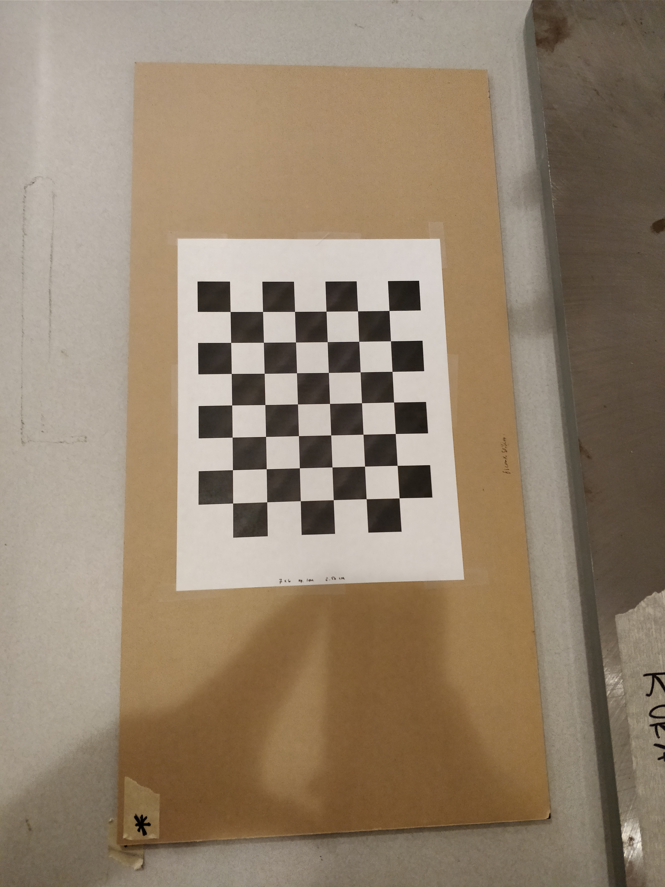
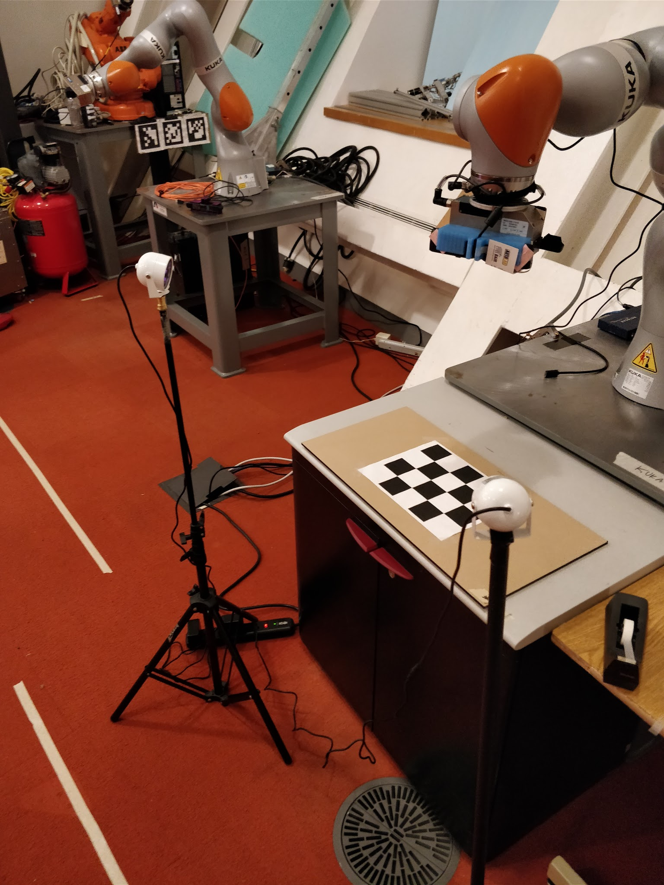

## Camera calibration in Spartan

---

### Calibration Target
There should already be a calibration target setup which looks like
<p align="center">
  
</p>

The pdf of this target is in `spartan/src/catkin_projects/camera_config/data/calibration_targets/check_7x6_108mm.pdf`. When sized to print on letter size paper the edge length of an individual square was measured to be 25.6 mm.

### Intrinsics calibration with ROS Camera Calibration
First we do intrinsics.
- Open director, put the robot into the `Calibration - intrinsics calibtration pose`
- Open rviz, view the rgb topic, make sure you can walk around with the calibration plate in it

In order to calibration intrinsics for rgb camera, execute the following command, replacing `xtion_pro` with the name of your camera.
```
rosrun camera_calibration cameracalibrator.py --size 7x6 --square 0.0256 image:=/camera_xtion_pro/rgb/image_raw camera:=/camera_xtion_pro/rgb
```

To run the calibration for the ir camera execute
```
rosrun camera_calibration cameracalibrator.py --size 7x6 --square 0.0256 image:=/camera_xtion_pro/ir/image camera:=/camera_xtion_pro/ir
```
- A window will pop out, you should move the calibration plate around until the `CALIBRATE` button gets colored.
- Click the `CALIBRATE` button, the calibration process might take a few seconds, during which the window might gray out, but it is working
- After the calibration is done. Click the `SAVE` button, the calibrated results will be saved to `/tmp/calibrationdata.tar.gz`. Run the following command to move the camera info file to the right place
```
python intrinsics_calibration.py --rgb --camera_name xtion_pro
```

And for IR do:
```
python intrinsics_calibration.py --ir --camera_name xtion_pro
```

Make sure to rebuild!

```
cd spartan/build
make catkin-projects/fast
```

You'll be sad if you don't rebuild.

### Prepare to capture images

- Decide the device's serial number or name
- Create a new folder in `src/catkin_projects/station_config/hand_eye_calibration` and create a new `.yaml` file.  Copy over the structure from another yaml file.
- Specify in `iiwamanipdev.py` what the name of this `.yaml` file is within `station_config`
- Create a new folder in `camera_config` and copy over the structure from other folders
- Rebuild catkin_project/fast
```
cd spartan/build
make catkin_projects/fast
```
- When you launch the sensor via `roslaunch camera_config openni2.launch`, pass the serial_number you chose

---

### Capture images

- Place the calibration target (place the pieces of tape with `*`s on them next to each other)

#### Capture RGB images

- Launch director
- `cal.run()` in the Python terminal (it's f8)
- (by default, the rgb images are captured)
- Open rviz, and look at the camera topic to make sure the target is in frame (at least in most images)
- Images will be saved to, for example:
```
spartan/calibration_data/20180201-233350_rgb/
```

#### Capture IR images

- WARNING: for unknown reasons saving mono16 ir images to .png does not work.  Make sure to use `.bmp` instead.  You can specify this in the `station_config/*/*.yaml` file
- Cover the projector (make sure to not tape the lens!!! A business card folded over, and taped so that no tape touches lenses)
- Set up the IR illuminators (see pic below)

<p align="center">
  
</p>

- View the IR images in rviz and make sure the IR illumination is good enough (it can be sensitive to the height and angle of the IR illuminator)
- `cal.run(captureRGB=False, captureIR=True)`
- Open rviz, and look at the camera topic to make sure the target is in frame (at least in most images)
- Images will be saved to, for example:
```
spartan/calibration_data/20180201-2335959_ir/
```

Remember to remove the projector-covering device!!

### Run calibration optimization on images

- Find the folder names of the `_rgb` and `_ir` images
- copy those folders (`cp -r`) into a subdirectory of spartan_grasp (for examples `spartan_grasp/sandbox`)
- Edit `test_run_camera_calibration.py` to point to the folder paths, and also edit the name and serail number of the camera
- `./test_run_camera_calibration.py`
- Calibration results will be stored in `spartan_grasp/sandbox/calibration_results`
- Copy the calibration results over back into `spartan` directory world (under `camera_config` -- copy the other folder structures)
- Remember to rebuild catkin_projects with `make catkin_projects/fast`

### Test the calibration quality

DO THESE TESTS:

1. Verify in rviz that the frames (rgb and depth) generally look in the right spot

2. Point the depth sensor down at the table and verify it looks generally flat

3. Can even point robot at itself and see if the point cloud matches the urdf

4. In RVIZ open `image_rect_color` and verify that it doesn't look distorted. A good way to do that is to look at the checkerboard and edges of the table.


TODO
- later: clean up station_config structure (not just one cal.yaml)
- extrinsics should live in station_config
- adjust joint limits
