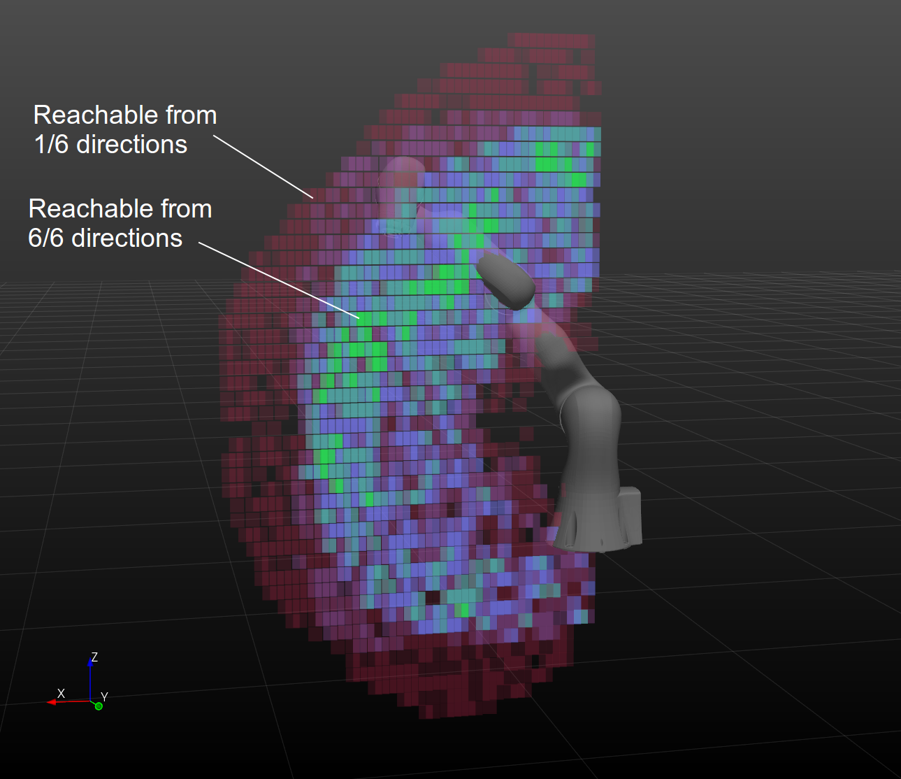

# Reachability Analyzer

Numerically probes the reachability of a robot via IK.

# Requirements

This relies on Drake for IK, and should be used with SNOPT for best
results (IPOPT is much slower). This also relies on the
RemoteTreeViewerWrapper library, which lives, at the time of
writing, in Spartan.

# Instructions for use

1. Make sure you have sourced spartan environment setup file in spartan/build/setup_environment.sh

2. Run `drake-visualizer` from the command line.

2. In a second terminal, run `reachability_analyzer <args>` from the command line. Default arguments
will perform a coarse reachability analysis for an IIWA. Progress will be reported at the command
line. Default behavior searches over each the six axis-aligned directions.

3. In the drake-visualizer, you will see point cloud visualization of the reachable points
along each search direction (reported points are reachable with the end effector aligned with
that direction). When the program completes, you will also see a color-coded visualization of how
many directions were reachable at each point, with colors spanning from red for few reachable
directions, to blue, and then to green for all directions reachable. You can use the scene browser
in the drake-visualizer to select which point cloud you'll look at (and remember that you can
select the point cloud object itself through that menu by opening all of the subfolders
and increase the point size to make the visiblity better).



# Arguments

`reachability_analyzer --help` will report available command line flags:

```
  Flags from /home/gizatt/spartan_4/src/ReachabilityAnalyzer/reachability_analyzer.cpp:
    -end_effector_frame_name (End effector frame name.) type: string
      default: "iiwa_frame_ee"
    -urdf (Path to robot URDF.) type: string
      default: "drake/manipulation/models/iiwa_description/urdf/iiwa14_primitive_collision.urdf"
```

Additional options -- search volume extent and step size, tolerances, and desired graps directions --
can be changed by tweaking their values in `reachability_analyzer.cpp` and recompiling. Sorry it's
not better yet!

# Code overview

`reachability_analyzer.cpp` loads in a specified URDF. A end effector frame (position + rotation) is
specified. For each of a set of desired end effector frame directions (with tolerances, so you could
set this tolerance very broad to query reachability), and each of a set of set of grid points
spanning a query volume, we query Drake IK to place the end effector frame at that position and
rotation. Points that return feasible are considered reachable.

# TODOs

- Better volume rendering
- Better command line arguments / configuration
- Output format?
- Test on other robots
